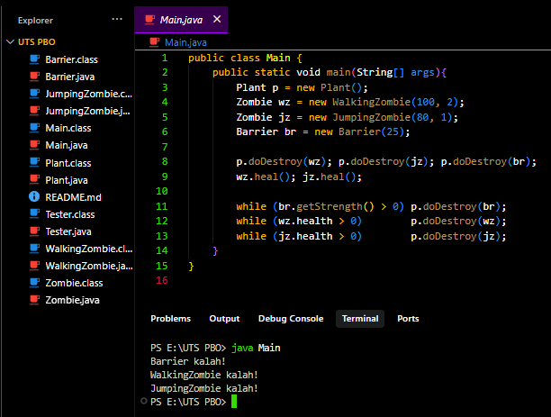
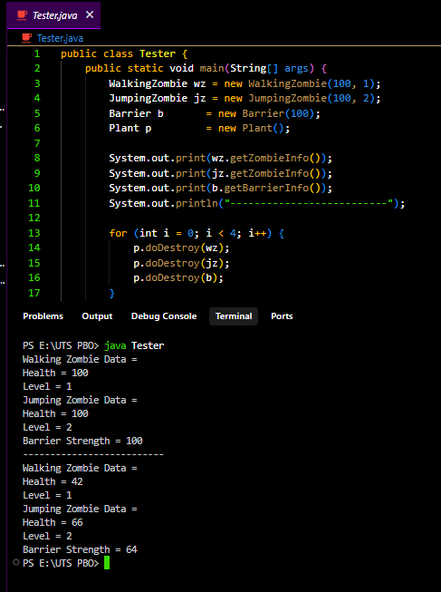

# UTS PBO - Zombie

## Cara Menjalankan

### Main.java
```bash
javac Main.java
java Main
```

**Output:**



### Tester.java
```bash
javac Tester.java
java Tester
```

**Output:**



## 👨‍💻 Author
**Hafis**
- GitHub: [@hafisc](https://github.com/hafisc)
- Repository: [UTS-PBO](https://github.com/hafisc/UTS-PBO)

